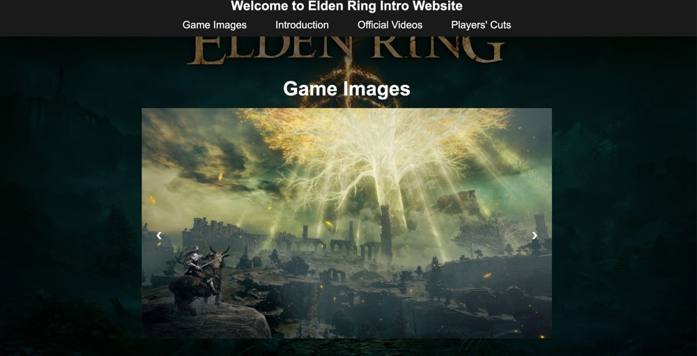

# Elden Ring Introduction Website

Welcome to the Elden Ring Intro Website, a fan-made project designed to showcase the breathtaking world, lore, and features of the popular action RPG, Elden Ring. This single-page application includes responsive design, interactive elements, and visually appealing animations to immerse visitors in the Elden Ring universe.

## Features

- Responsive Design: Optimized for multiple screen resolutions (1920x1080, 1366x768, 1280x720, and 1024x768).
- Sticky Navbar: A navigation bar that remains visible while scrolling, with a dynamic resizing feature.
- Smooth Scrolling: Navigate seamlessly between sections using smooth scrolling effects.
- Interactive Carousel: A slider with engaging content about Elden Ring's characters, environments, and mechanics.
- Modal Windows: Popups displaying additional information and media about the game.
- Fixed Background Image: Parallax scrolling effect for enhanced visual appeal.
- CSS3 Animations: Subtle animations for a dynamic browsing experience.
- HTML5 Video Integration: Embedded trailers and gameplay videos.
- Social Media Integration: Direct links to official Elden Ring pages and fan communities.

## License

This project is licensed under the **MIT License**. Feel free to use, modify, and distribute this project.
